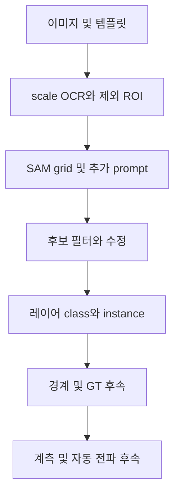

# TEM 분석기 개발 설계 및 인수인계

작성 2026-09-29. 범위는 첫 영상에서 스케일·제외 영역을 지정하고 SAM mask를 레이어별로 검수하는 단계이다. 현업 문제는 MRAM/ReRAM TEM의 층마다 ROI와 레시피를 반복 지정하고 흐린 경계를 검수하는 데 드는 시간이다. 최종 목표는 비슷한 여러 영상에 기준을 전파해 두께·CD 등 계측을 자동화하는 것이지만 이 버전은 계측을 제공하지 않는다.

## 파이프라인

## 모듈 경계

`api.py`는 입력 검증과 UI 연결, `storage.py`는 원본·무손실 마스크와 JSON의 원자 저장, `operations.py`는 독립 영상/마스크 연산, `sam_service.py`는 GPU/CPU 모델 추론, `ocr.py`는 선택적 로컬 EasyOCR, `web/`은 UI다. 기능 추가 시 SAM 추론 알고리즘은 UI 파일 대신 서비스에 넣는다. 메타데이터에는 `image_id`, `candidate.id`, `layer_id`, `instance_id`, `parent`, `source`, `prompts`가 보존된다.

다섯 페이지: (1) 이미지·스케일·템플릿, (2) SAM·레이어, (3) 경계·GT 현재 표시와 검수 상태만, (4) 계측 현재 placeholder, (5) 설정/모델 상태. 미구현 페이지의 기능이 완료된 것처럼 값이나 GT를 출력하지 않는다. UI는 HTML/CSS/JS를 분리해 색·배치 수정이 독립적이다.

## 현재 코드의 핵심 경로

- 공식 SAM ViT-H 기본, L/B 선택. GPU A100은 auto CUDA, CPU는 auto CPU. CPU에서 ViT-B 권장.
- grid points_per_side 기본 16. 제외 ROI의 점을 제거. SAM AutomaticMaskGenerator에서 predicted IoU, stability, bbox NMS를 지정. 각 설정 0~1, grid 2~32. 생성 후보 메타데이터에 점수/박스/출처를 남긴다.
- 사용자 추가 +/−점과 box는 grid와 별도 predict 호출. ROI 내부 재분할은 원본 픽셀 crop을 사용하고 좌표 복원. 선택 mask 복제 및 브러시 변경은 새 후보를 만들어 parent ID로 연결한다.
- 같은 class에 여러 instance 이름을 둘 수 있으나 현재 자동 instance 탐색은 하지 않는다. 확정된 후보 간 겹침과 미분류 픽셀 수를 표시한다.
- 기본 template의 scale ROI, text ROI는 정규화 좌표. 문자 영역은 원본에서 지우지 않고 분석 제외; 원본 파일은 보존. nm/px는 수동 두 점 또는 OCR+바 제안을 사람이 확정한다.
- 동일 구조의 SAM decoder state_dict는 기본 SAM 모델에 교체. 별도 후단 refiner는 TorchScript로 SAM 이후 실행. ABL은 학습 조건이며 추론 구조를 바꾸지 않는다.

## 저장 계약

`project.json`: schema_version 1, images, templates, selected_template, layers, candidates, next_candidate, scale. `images/<image_id>.png`와 `masks/<image_id>_<candidate_id>.png`는 원본 해상도 무손실. 후보와 레이어 상태는 앱 변경 시 JSON을 원자 저장한다. 회사 데이터가 Git에 들어가지 않게 `projects/`를 ignore한다. 파일을 옮길 때 프로젝트 디렉터리 전체를 복사해야 한다.

## 후속 구현의 구체적 입력과 출력

경계·GT 모듈은 이미지, 검수된 class·instance mask, 텍스트 제외 영역과 원본 좌표를 입력한다. ±5~10 px 법선 탐색, gradient/contrast 점수와 DP 연속성을 비교하고 사람 확인 후 semantic uint16 PNG/NPY, boundary 0/1 PNG/NPY, valid semantic/edge를 출력한다. JPG는 라벨 GT로 쓰지 않는다. 누락·겹침·층 변경을 먼저 검사한다.

계측 모듈은 선택한 class와 instance, 기준층 계면, measurement ROI/방향, nm/px, 회전 affine을 입력한다. 각 영상에서 instance를 찾고 mask 계면의 중앙과 중심축 교점으로 anchor를 만들며 이후 보정 계면으로 다시 계산한다. 다른 영상으로는 anchor의 절대 좌표를 복사하지 않고 구조 정합 후 새 계면을 찾는다. 셀 혼동/계면 부족/스케일 미확정 시 수치를 내지 않고 검수 대기로 보낸다.

## 미완료 항목과 다음 작업

1. 모델 실제 가중치로 ViT-H/L/B·decoder FT ±ABL·후단 refiner ±ABL 추론 연결과 비교 평가.
2. grid/점 조합에서 작업 진행률·취소·비동기 큐. CPU 사용성 측정.
3. 필터 이전 자동 후보/억제 이유 보존, 후보별 stability 표시와 threshold 재적용.
4. scale 바 후보 여러 개 비교, OCR 문자 제거 영역 수동 수정, 템플릿별 일괄 적용 확인.
5. 브러시 영구 undo/redo, layer instance 자동 분리와 충돌 해결.
6. 경계·GT 실제 export, 수평 정렬·anchor·계측·다음 영상 자동 전파.

## 검증과 발표 KPI

먼저 회사 내 미학습 영상으로 grid 기본값, 추가점, ROI 재분할의 마스크 IoU/Dice, 누락된 층, 검수 시간·클릭 수, 추론 시간을 비교한다. 후보 필터 점수는 GT 정확도가 아니다. 학습 모델의 비교는 동일 영상·동일 prompt에서 수행하고 train/test를 시편 단위로 분리한다. 이미지 7장 결과는 사례 검증으로만 보고한다. 경계/계측이 아직 없는 이 버전에서 TAT 개선을 계측 자동화 전체의 실적이라고 주장하지 않는다.

## v1.2 변경

프롬프트 준비는 prompts.py의 grid 생성과 비지도 K-means 추가점 제안으로 분리했습니다. /api/prompts/grid 및 /api/prompts/ml은 SAM을 호출하지 않고 점 좌표만 반환합니다. /api/sam/prepared는 현재 UI의 점 목록 및 box를 받아 SAM을 실행합니다. 모델 서비스는 prepared_points를 정규화해 공식 SAM 자동 생성기에 전달합니다. 수동 객체점은 별도 predictor 호출로 보존합니다. 후보와 레이어 삭제는 API가 관리하고 레이어 mask endpoint는 class ID별 합집합 PNG를 반환합니다. UI는 그레이스케일 mask 값으로 alpha를 구성하고 요청 순서 토큰을 검사하여 늦은 이전 응답을 무시합니다.
